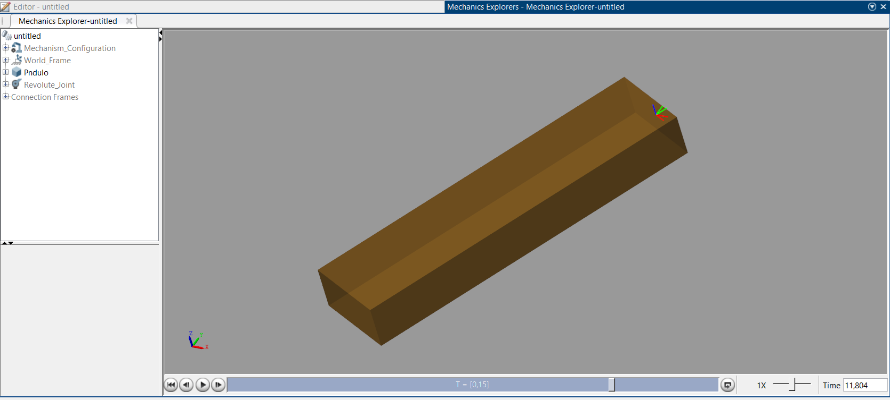
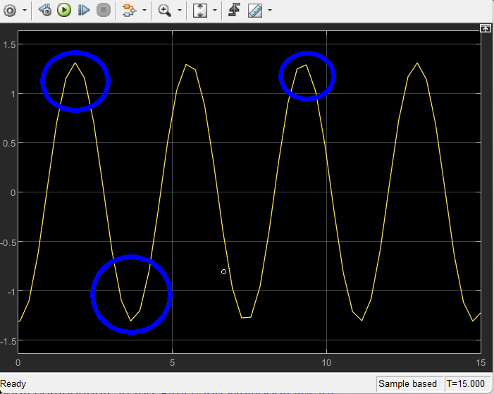
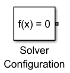

27 / 02 / 2025
# Introducción a Simscape Multibody
Simscape Multibody es una herramienta de MATLAB/Simulink que permite modelar, simular y analizar sistemas mecánicos multicuerpo, facilitando la representación gráfica y la simuolación de la dinámica y cinemática de cuerpos rígidos con juntas o articulaciones, actuadores y restricciones, haciendolo un programa ideal para aplicaciones de robótica [1]. Permite modelar sistemas mecánicos 3D, como robots, maquinaria pesada, vehículos, etc.

## ¿Qué ofrece Simscape Multibody?
Simscape se encarga de formular y resolver las ecuaciones diferenciales que modelan el comportamiento dinámico de los sistemas físicos, incluyendo las ecuaciones cimenáticas. Permite observar la respuesta temporal de cada variable durante la simulación, proporcionando una representación detallada del sistema.

Además, genera  una animación 3D que muestra el comportamiento a lo largo de toda la dinámica, permitiendo visualizar la evolución del sistema en cada instante de tiempo.

## ¿Qué diferenicas hay entre Simscape Multibody y los software CAD?
1. El software CAD permite realizar modelados y simulaciones para analizar esfuerzos, tipos de materiales y el comportamiento estructural frente a diferentes fuerzas. Sin embargo, este tipo de software no ofrece la posibilidad de observar la dinámica del sistema, es decir, cómo se comporta en términos de movimiento, fuerza y velocidad. No permite graficar curvas que representen la variación de la posición o la velocidad con respecto al tiempo, lo que limita el análisis dinámico del sistema.

2. Aunque permite realizar operaciones como extrusión, perforación y otras tareas similares, no se recomienda ejecutarlas en el entorno de simulación (Simscape Multibody), ya que este se basa exclusivamente en coordenadas y medidas, lo que puede limitar la precisión y la representación de dichos procesos.

### Ventajas
1. Permite la simulación de diversos sistemas físicos, como sistemas hidráulicos, eléctricos y neumáticos.
2. Facilita la integración de la parte mecánica, el actuador y el controlador dentro del mismo entorno de simulación.
3. Proporciona herramientas eficaces para el analisis y validación de diseños antes de la implementación física.
4. Mejora la comprensión del comportamiento dinámico del sistema a través de representaciones gráficas y animaciones.

# 📚 Ejemplo 1: Péndulo Simple

Figura 1. Creación Pendulo Simple

Se pueden generar todos los solidos y restricciones que requiere el mecanismo. En el ejemplo 1 se definio como restricción de movimiento la rotación del objeto, obteniendo el movimiento de pendulo. Tambien se le puede programar gravedad, esta forma no se requiere de una entrada al pendulo.

Figura 2. Señal resultante Pendulo Simple

Al analizar la señal resultante se observa que la configuración de simulación influye en la gráfica, por eso se generar picos en los máximos y minimos. Una forma de corregir esta señal es aumentando el tiempo de muestro en el *Solver de simulación*.

## Interfaz Simscape Multibody

Figura 3. Solver Configuration

La configuración del *Solver* genera un modelo matemático que incluye las ecuaciones diferenciales, su solución y los parámetros para su correspondiente sintonización. 
El *Solver* usa por defecto todas las configuraciones que estan establecidad en el simulador, como el timepo de muestreo o método de integración. Dando la posibilidad de omitir el transitorio, unicamente viendo el estacionario, el máximo error de tolerancia permitido y escoger un solver diferente. 

Figura 4. World Frame

Genera el eje de coordenadas, permite colocar todos los solidos dentro de ese sistema coordenado. Este eje de coordenada slo genera por defecto al colocarlo en la simulación.

Figura 5. Mechanism Configuration

Configura el marco de referencia de leyes fisicas, permite configurar fuerzas externas afectando a los solidos y los movimientos. Cabe mencionar que trae la gravedad por defecto en el eje Z, pero se rocomienda cambiarla al eje Y.

Por defecto trae configurado la aceleración de la gravedad, permitiendo agrevar fuerzas a los 3 ejes dependiendo de lo que se requiere.

# Conclusiones
1. La señal sinusoidal observada está influenciada por la configuración del simulador. Para mejorar su calida, es necesario configurar los tiempos de muestreo con los que se generan las soluciones, así como seleccionar el método de integración más adecuado.
2. La fluidez del movimiento depende de la cantidad de puntos de solución generados. Un mayor número sw puntos permite una representación más continua, evitando la pérdida de información.
3. Cada algoritmo de integración está optimizado para determinadad condiciones, como la frecuencia de respuesta de la integral o cambios no periódicos en la señal, lo que garantiza una mejor precisión en la simulación.
4. La reducción del tiempo de muestreo permite considerar un mayor número de puntos en los cálculos, lo que incrementa la precisión del análisis, pero también conlleva un mayor consumo de recursos computacionales.

# Referencias
1. SimScape Multibody. (s. f.). https://la.mathworks.com/products/simscape-multibody.html
2. “Login aulas 2025”, Edu.co. [En línea]. Disponible en: https://aulas.ecci.edu.co/mod/resource/view.php?id=217529&forceview=1. [Consultado: 11-feb-2025].
